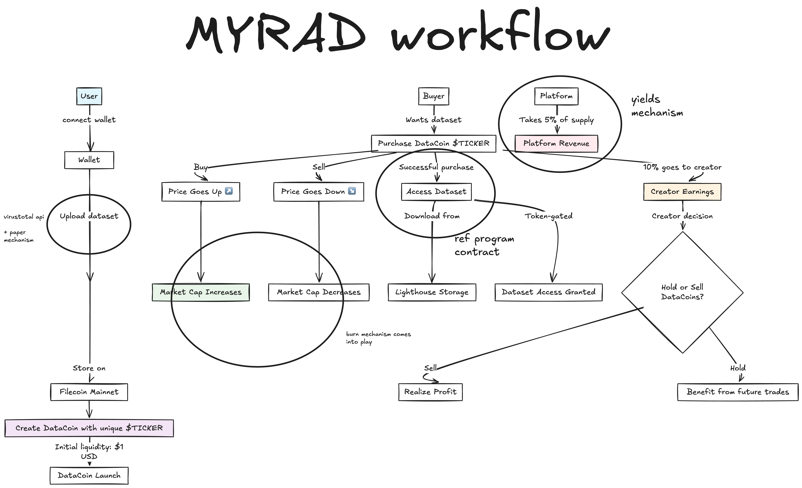

# MYRAD — Decentralized Data Marketplace

A blockchain-powered marketplace for tokenizing, trading, and monetizing datasets. MYRAD enables data creators to mint ERC20 tokens representing their datasets, trade them using automated market makers (AMM), and grant dataset access through a burn-to-download mechanism.

**Live Demo:** [https://myradhq.xyz/](https://myradhq.xyz/)

## Overview

MYRAD revolutionizes how datasets are valued and traded by:

- **Tokenizing datasets** as ERC20 tokens on the Base blockchain
- **Creating liquidity pools** pairing dataset tokens with USDC
- **Enabling permissionless trading** through constant product AMMs
- **Granting dataset access** through token burning with JWT-based download authorization
- **Providing transparent pricing** and fee distribution (80% Liqudity Pool, 5% Creator, 5% treasury)

## Key Features

### 📤 Dataset Upload & Tokenization
- Upload datasets to IPFS via Lighthouse gateway (up to 10MB)
- Create DataCoin ERC20 tokens representing your dataset
- Configure token metadata: name, symbol, IPFS CID

### 💱 Decentralized Trading
- Trade dataset tokens against USDC using an automated market maker
- Fee split: 0% Fees for buy and sell
- Real-time price quotes and slippage protection

### 🔥 Burn-for-Download Access Control
- Burn tokens to request dataset download access
- Automatic JWT issuance for 30-minute download windows
- Backend event listener detects burn transactions
- IPFS gateway download links with time-limited access

### 📊 Marketplace Features
- Browse all available datasets and their token details
- View token reserves, price, and pool state
- Buy/sell quotes before executing trades
- Access control verification for downloads

## Workflow:




## How It Works

### 1. Dataset Upload and Create a Dataset Token

### 2. Initialize the Liquidity Pool

The dataset creator seeds the pool with:
- **Token Seed:** 900,000 tokens (initial supply)
- **USDC Seed:** 1 USDC

This creates the initial price: 1 MEDREC ≈ 0.0000011 USDC

### 3. Buy Dataset Tokens

Users swap USDC for dataset tokens:

**Example:** Buy with 0.1 USDC → Receive ~77,946 tokens

The AMM uses constant product formula: `k = reserve_token × reserve_usdc`

### 4. Sell Dataset Tokens

Users swap tokens back to USDC (no fee on sells):

### 5. Burn Tokens for Download Access

After buying tokens, users burn them to unlock the dataset:

1. User initiates burn transaction
2. Backend listener detects burn event (5-20 seconds)
3. JWT access token is issued
4. User receives download link with 30-minute expiry

## Smart Contracts

### DataCoin (ERC20)
- Represents a single dataset
- Supports token burning with event emission
- Decimals: 18

### DataTokenMarketplace (AMM)
- Constant product AMM (x × y = k)
- Pool initialization: `initPool(token, creator, tokenSeed, usdcSeed)`
- Buy/Sell functions with slippage protection
- Fee handling: 5% on buys, 0% on sells

### DataCoinFactory
- Creates new DataCoin tokens
- Stores metadata CIDs
- Tracks creator addresses

**Network:** Base Sepolia (Testnet)
**Token Standard:** ERC20 with burn functionality

## Tech Stack

### Frontend
- **React 18** with TypeScript
- **Vite** for bundling and hot reload
- **TailwindCSS 3** for styling
- **React Router 6** for navigation
- **Radix UI** component library

### Backend
- **Express.js** for REST API
- **ethers.js v6** for blockchain interaction
- **Hardhat** for contract deployment
- **IPFS/Lighthouse** for decentralized storage

### Blockchain
- **Base Sepolia** testnet
- **ERC20** token standard
- **OpenZeppelin** contracts (security audited)

### Data Storage
- **IPFS** via Lighthouse gateway
- **JWT** for download access control

## Installation

### Prerequisites
- Node.js 18+
- pnpm (preferred) or npm
- MetaMask or Web3 wallet
- USDC tokens on Base Sepolia (get from faucet)

### Setup

```bash
# Clone the repository
git clone https://github.com/ArgyPorgy/MYrAD.git
cd MYrAD

# Install dependencies
pnpm install

# Set up environment variables
cp .env.example .env.local

# Configure required variables:
# - PRIVATE_KEY (for server operations)
# - LIGHTHOUSE_API_KEY
# - FACTORY_ADDRESS
# - MARKETPLACE_ADDRESS
# - USDC_ADDRESS
# RPC URL is now hardcoded to Alchemy endpoint

# Start development server
pnpm dev
```

The app runs on `http://localhost:5173` with the backend API on `http://localhost:4000`.

### For Development
- Use testnet USDC and Base Sepolia
- Test keys only (never production keys)
- Avoid committing `.env` files

### For Production
- Use mainnet after extensive auditing
- Change `DOWNLOAD_SECRET` for JWT signing
- Use separate wallets for server operations
- Enable HTTPS and rate limiting
- Monitor logs and set up error tracking (Sentry)
- Implement user authentication

### Best Practices
- Input validation on all API endpoints
- Slippage protection on swaps
- OpenZeppelin-audited contracts
- No known vulnerabilities in dependencies


### Environment Variables Required
- `PRIVATE_KEY` - Server wallet private key
- `MYRAD_TREASURY` - Treasury wallet address
- `DOWNLOAD_SECRET` - JWT signing secret
- `LIGHTHOUSE_API_KEY` - IPFS API key
- `FACTORY_ADDRESS` - DataCoinFactory contract address
- `MARKETPLACE_ADDRESS` - Marketplace contract address
- `USDC_ADDRESS` - USDC token contract address
- `PORT` - Server port (default: 4000)
- RPC URL is now hardcoded to Alchemy endpoint

## Development Commands

```bash
# Start development server (client + API)
pnpm dev

# Build for production
pnpm build

# Start production server
pnpm start

# Run tests
pnpm test

# Type check
pnpm typecheck
```

## Contributing

Contributions are welcome! Please:

1. Fork the repository
2. Create a feature branch:
3. Commit changes:
4. Push to branch: 
5. Open a pull request

Please follow existing code patterns and include tests for new features.

## Roadmap

- [ ] Mainnet support (Base)
- [ ] Advanced filter and search on marketplace
- [ ] User authentication and profiles
- [ ] Dataset versioning
- [ ] Multi-currency support (ETH, MATIC, etc.)
- [ ] Smart contract upgrades and governance
- [ ] Mobile application
- [ ] API rate limiting and billing

## License

See [LICENSE](LICENSE) for details.

## Support

- **Documentation:** [https://myradhq.xyz/docs](https://myradhq.xyz/docs)
- **GitHub Issues:** [Report bugs or request features](https://github.com/ArgyPorgy/MYrAD/issues)

## Disclaimer

MYrAD is a testnet platform. All operations use Base Sepolia testnet. Do not use with real funds or sensitive data until fully audited and deployed to mainnet.

---

**Built with ❤️ for the decentralized data economy**
